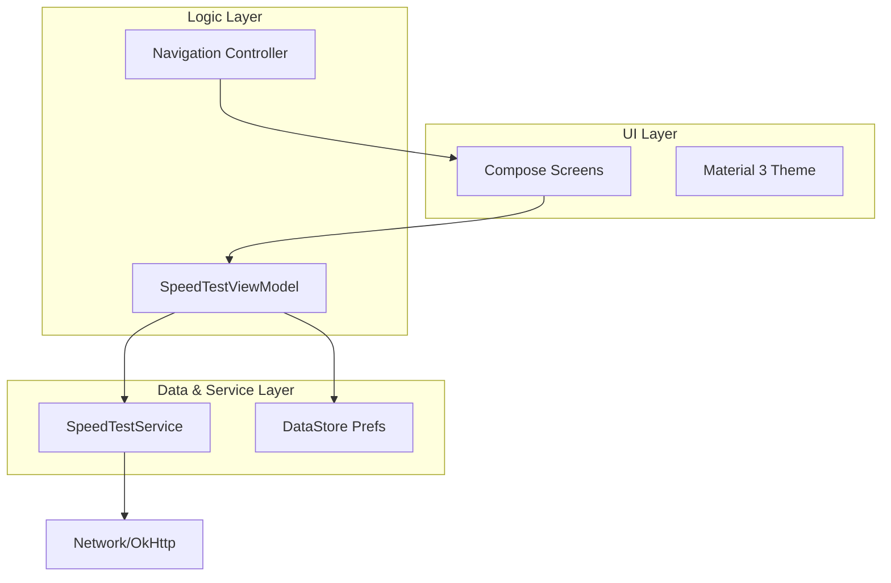

# NetPulse - Android Network Speed Monitor

NetPulse is a professional network monitoring and speed testing application built with modern Android development practices. It provides real-time insights into your network performance, including download speed, upload speed, latency (ping), and jitter.

---

## 🚀 Key Features

*   **Real-time Speed Measurement**: High-precision tracking of download and upload speeds.
*   **Network Health Diagnostics**: Comprehensive monitoring of Ping, Jitter, and Packet Loss.
*   **Modern UI**: Fully responsive interface built with Jetpack Compose and Material 3.
*   **Persistent Preferences**: User settings and onboarding state managed via DataStore.
*   **Background Testing Engine**: Robust measurement logic decoupled from the UI using a dedicated service.
*   **Dynamic Theming**: Seamless support for Light and Dark modes.

---

## 🛠 Tech Stack

*   **Language**: Kotlin
*   **UI Framework**: [Jetpack Compose](https://developer.android.com/compose) (Material 3)
*   **Architecture**: MVVM (Model-View-ViewModel)
*   **Navigation**: [Compose Navigation](https://developer.android.com/jetpack/compose/navigation)
*   **Data Persistence**: [Jetpack DataStore](https://developer.android.com/topic/libraries/architecture/datastore)
*   **Networking**: [OkHttp](https://square.github.io/okhttp/)
*   **Concurrency**: Kotlin Coroutines & Flow

---

## 📁 Project Structure

The project follows a clean architecture pattern to ensure maintainability and scalability:

```text
NetPulse/
├── app/
│   ├── src/
│   │   ├── main/
│   │   │   ├── java/com/example/netpulse/
│   │   │   │   ├── data/             # Data sources and Preferences (DataStore)
│   │   │   │   ├── navigation/       # Navigation routes and configuration
│   │   │   │   ├── service/          # Core Speed Test measurement logic
│   │   │   │   ├── ui/
│   │   │   │   │   ├── screen/       # UI Screens (Splash, Onboarding, Home)
│   │   │   │   │   ├── viewmodel/    # Logic and State management (MVVM)
│   │   │   │   │   └── theme/        # Typography, Shapes, and Colors
│   │   │   │   └── MainActivity.kt   # Application entry point
│   │   │   └── res/                  # Static resources (Icons, XML)
```

---

## 📊 High-Level Architecture



---

## ⚙️ Installation & Setup

1.  **Clone the repository**:
    ```bash
    git clone https://github.com/yourusername/NetPulse.git
    ```
2.  **Open in Android Studio**: Use Android Studio Ladybug (2024.2.1) or newer.
3.  **Sync Gradle**: Allow the project to download necessary dependencies.
4.  **Run**: Deploy to a physical device or emulator with API 24+.

---

## 📄 License
This project is licensed under the MIT License - see the LICENSE file for details.
